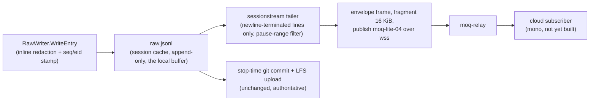

# Session JSONL Streaming over MoQ

**Status:** Proposed (design ahead of implementation). No code ships in this PR.
**Scope:** design contract for `internal/moq` (PR 2a) and `internal/daemon/sessionstream` (PR 2b).
**Reviewed by:** four adversarial principal-engineer panels (security, streaming correctness,
daemon fit, simplicity). Their confirmed findings are folded into the requirements below.

## Purpose

Stream each active coding session's redacted `raw.jsonl` to the cloud live, in parallel with
the existing stop-time git-commit upload. The git path remains the durability authority; the
stream is a best-effort live duplicate. Applies uniformly to every shimmed agent because both
live producers (daemon tail mode and the Claude Code hook process) converge on `raw.jsonl`.

Gated by `FEATURE_SESSION_STREAMING` (default off). The env flag is a local opt-in only —
streaming starts only after the authenticated coordinates call succeeds, so the cloud's
account-level feature check is the authoritative enable.

## Non-goals (v1)

- Durability via the stream (git upload owns that; see Ack semantics).
- Bi-directional control (reserved: ADR-071 composition — a parallel Subscriber on a control
  track; nothing wired in v1).
- Conversation-native (`KBTurnLine`) emission — mapping documented below as future.

## Data flow



Cursor (`stream-cursor.json`, session cache dir, 0600, atomic temp+rename) records the last
fully-published entry seq + byte offset. Safe to lose: restart from 0 is correct under
at-least-once. Clamped to file size on load.

## Envelope (v1)

One JSON object per published payload, wrapping raw.jsonl lines verbatim:

```json
{"v":1, "session_id":"ses_<uuidv7>", "seq":42, "kind":"entry", "payload":{ "...redacted SessionEntry..." }}
```

- `kind`: `header` | `entry` | `footer`, mirroring raw.jsonl's three line shapes.
- `header` payload additionally carries `session_name`, `repo_id`, `team_id`, agent/coworker
  identity (from `StoreMeta`).
- `seq` is the sole ordering/dedup authority. `sent_at`, if present, is observational only.
- Consumers MUST ignore unknown fields (mirrors `docs/specs/adapter-protocol.md` version
  evolution). Version bumps: additive fields never bump `v`; semantic changes do.
- Duplicates are expected (at-least-once). Server dedup key: `(session_id, seq)`.

### seq/eid stamping (new, PR 2b)

Live-recorded entries carry no `seq`/`eid` today (the seq-injecting `SessionWriter` in
`internal/session/store.go` is not on the live path). PR 2b adds `Seq int64` + `Eid string`
to `session.SessionEntry`, stamped inside `RawWriter.WriteEntry` — running count since
header. Every consumer benefits; redaction path unchanged.

## Pause exclusion (publish-time, CRITICAL)

Pause/resume is upload-time filtering today (ADR-020): raw.jsonl keeps receiving entries
while paused. The publisher therefore consults `RecordingState.SuspendedAt` + lifecycle
pause markers per entry and skips (never publishes) any entry whose seq lies in an open or
closed suspended range. The read cursor still advances. Without this, live streaming would
ship exactly the content the user paused to exclude — MoQ has no retraction.

## Ack semantics (honest version)

moq-lite has no object-level acknowledgment; a successful send means bytes left the process
(ADR-071). Cursor advance therefore encodes local send success, NOT durability. If a receipt
plane is added later it mirrors what mono shipped for audio: out-of-band SSE watermark
(ADR-071 Option A) — not an in-band ack track.

## Retroactive redaction (policy)

The deferred redaction tier (pre-push auto-redact/quarantine, `ox session redact`, catalog
re-scans) fires after write time and can only scrub local copies. Live streaming forfeits
that net for already-streamed bytes. Policy: dogfood-only until the mono purge/re-redact API
(keyed `(session_id, seq)`) exists; the retroactive-redact code paths call it when streaming
was active for the session. Customer enablement blocks on that API.

## Transport

moq-lite-04 over WebSocket TLS (TCP/443), pure Go (`internal/moq`):

- Relay already exposes WS ingress; ESP32 firmware proves the path; no Go MoQ client exists;
  avoids a QUIC dependency. Dep: `coder/websocket` (MIT).
- One WS binary message per MoQ frame; OFF+LEN fragmentation above 16 KiB (qmux frame cap);
  group rotation on a small bound (N entries / M seconds) so reconnect never replays
  unbounded groups (a group is the resume unit; never resume mid-group).
- Coordinates `{broadcast_name, relay_url, jwt}` come from a new api-go endpoint (request
  `{session_id, session_name}`) — the coding-session analog of recordings `mode:"moq"`. All
  three are opaque to ox. JWTs are ~1 h: re-fetch on reconnect/near-expiry via OAuth
  `EnsureValidToken`; JWT held in memory only.
- Fail closed: `wss://` required off-loopback; never `InsecureSkipVerify`;
  `OX_ALLOW_PLAINTEXT_ENDPOINT` does not loosen MoQ TLS except loopback (twin tests).
- Decoder treats relay input as untrusted: strict bounds checks, frame/object size caps,
  typed errors, no panics.

## Daemon integration (`internal/daemon/sessionstream`)

- `Manager` discovers active recordings (`.recording.json` scan), one publisher goroutine per
  session; re-attaches on daemon start (`DetectAndRestart` pattern).
- Hook-mode session activity feeds the daemon inactivity timer so a live Claude Code session
  cannot idle-exit the daemon mid-stream (1 h timeout today).
- Resilience: `resilience.CircuitBreaker` + exponential backoff; reconnect re-fetches
  coordinates, resumes from cursor at a group boundary. All failures log-only (single-line
  key=value); never surfaced to session flow. Flag off ⇒ Manager never constructed.
- Read-ahead bounded by bytes (backpressure), not entry count — `tool_output` entries can be
  multi-MB.
- Tailer consumes only `\n`-terminated lines; on EOF with unterminated trailing bytes it does
  not advance (torn-write safety). New raw-jsonl `ParseLineFunc` dispatches header/entry/footer.
- `rewriteRawJSONL` (regenerate/redact) refuses to rewrite a session with an active recording.

## Future: conversation-native mapping (not built)

| envelope/`SessionEntry` | `KBTurnLine` (`turns.jsonl`) |
|---|---|
| `session_id` | `session_id` |
| `seq` | `seq` |
| `type` user/assistant | `author_kind` human/coworker |
| `ts` | `created_at` |
| `content` | `body` |
| `tool_name`/`tool_input`/`tool_output` | `metadata.extras.tool_use` |
| `coworker_model` | `metadata.model` |
| `eid` | `idempotency_key` |

`cnv_` twin id derivation and turn coalescing (N entries into one turn) are cloud-side
decisions; deferred until mono locks the consumer.

## Cloud contract (mono-side, required before customer enable)

1. Coordinates endpoint + account feature check (`features.session_streaming`).
2. Purge/re-redact API keyed `(session_id, seq)`.
3. Session archiver with narrowest `get` (per-team; ideally per-broadcast JIT), separate
   service identity + prefix namespace from the audio archiver; asymmetric relay signing
   (EdDSA/RS256) recommended.
4. Server dedup on `(session_id, seq)`.

## Implementation phases

| PR | Lands | Proves |
|---|---|---|
| 2a | `internal/moq` client + codec + `moqtest` twin + goldens | transport in isolation (riskiest unit) |
| 2b | seq stamping, `sessionstream` manager, cursor, pause filter, resilience, this spec | end-to-end tail-to-relay with a twin |

Test harness (PR 2b): codec round-trip + conformance; one twin round-trip E2E (twin's received
JSONL equals redacted `raw.jsonl` minus paused ranges); cursor crash-safety (crash at every
step around publish/cursor-write, no loss, dedup on `(session_id, seq)`); pause test; flag-off
test (zero network, zero stream files). Deferred until mono locks the consumer: 5-way relay
fault matrix, full golden wire suite, staging-relay integration.
