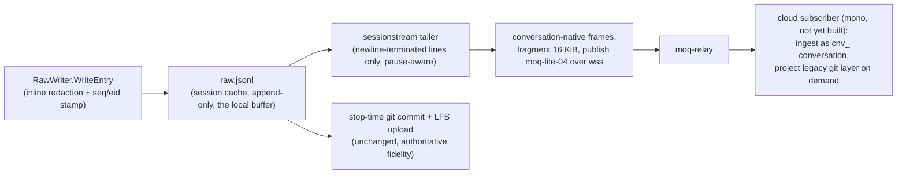

# Session JSONL Streaming over MoQ

**Status:** Proposed (design ahead of implementation). No code ships in this PR.
**Scope:** design contract for `internal/moq` (PR 2a) and `internal/daemon/sessionstream` (PR 2b).
**Reviewed by:** four adversarial principal-engineer panels (security, streaming correctness,
daemon fit, simplicity), then remapped onto the current conversation model
(mono ADR-057/076/081/087, `packages/conversation`, `packages/chat`).

## Purpose

Stream each active coding session's redacted conversation to the cloud live, in parallel with
the existing stop-time git-commit upload. The git path remains the durability and fidelity
authority; the stream is a best-effort live feed. Applies uniformly to every shimmed agent
because both live producers (daemon tail mode and the Claude Code hook process) converge on
`raw.jsonl`.

The stream is **conversation-native**: it speaks the ontology's vocabulary (mono ADR-057/076/081)
so the server ingests it as a first-class conversation of `type='session'`. Coding sessions are
the first real consumer of live `type='session'` ingestion — this spec defines that producer
contract. Anything legacy-shaped (the git `data/sessions/…/{meta.json, turns.jsonl, …}` folder)
is a **server-side projection** of the conversation, per ADR-081's settled principle ("the git
folder is the conversation's projection") — the stream never contorts itself to look like the
old JSONL; the server down-converts when a legacy layer is wanted.

Gated by `FEATURE_SESSION_STREAMING` (default off). The env flag is a local opt-in only —
streaming starts only after the authenticated coordinates call succeeds, so the cloud's
account-level feature check is the authoritative enable.

## Non-goals (v1)

- Durability via the stream (git upload owns that; see Ack semantics).
- Losslessness. `raw.jsonl` reaches the ledger via git/LFS at stop; the stream is the live
  conversation feed, not a byte-replica channel.
- Bi-directional control (reserved: ADR-071 composition — a parallel Subscriber on a control
  track; nothing wired in v1).
- Rich workspace events (`artifact.*`, `widget.*`, `approval.*` from `workspace.events.jsonl`)
  — the envelope's `kind` space leaves room; v1 emits turns + tool events + lifecycle only.

## Identity & conversation binding

- The coding session id is **`ses_<UUIDv7>`**, minted at session start (already the case:
  `lfs.SessionMeta.EffectiveSessionID`). Its conversation is the twin **`cnv_<same-uuid>`** —
  a pure prefix swap (`ids.SessionIDToConversationID`), no lookup, lossless. The stream
  carries `conversation_id`; the server can swap back for the git projection.
- Never mint a `cnv_` payload different from the session's (keeps the 1:N-deferral twin rule
  intact). `cli_` is the `ox login` auth-session prefix and has nothing to do with this.
- The destination (team) binds on the first coordinates call and is immutable for the
  conversation's life, mirroring the `CaptureTurns` contract.
- Sub-references (`tool_use_id`, future `art_`/`wid_`) travel as separate fields, never
  `:`-joined composites.

## Data flow



Cursor (`stream-cursor.json`, session cache dir, 0600, atomic temp+rename) records the last
fully-published wire `seq`, the last published entry seq, the byte offset into `raw.jsonl`,
a compact **wire-seq journal** (`seq` ↔ kind + `entry_seq`, contiguous runs collapsed to
ranges — the mapping amendments need to replay under original seqs), and the file's
**generation identity** (header `eid` + a rewrite-generation counter). On
open, if the identity does not match the file (a sanctioned rewrite happened), the cursor
resets to a safe replay point and replayed content is published as an **amendment** (bumped
`revision`, below) — never as silently-skipped or mid-record bytes. Safe to lose entirely:
restart from 0 is correct under at-least-once. Byte offset clamped to file size on load.

## Envelope (v1)

One JSON object per published payload. Vocabulary follows `conversation.TurnLine` (ADR-076)
extended with fidelity fields the transport can afford (MoQ fragments large objects; the
32 KiB/turn cap is a property of the MCP `CaptureTurns` endpoint, not of this stream — the
server applies caps at projection time):

```json
{"v":1, "conversation_id":"cnv_<uuidv7>", "seq":42, "revision":0, "kind":"turn",
 "turn":{
   "entry_seq":37,
   "role":"assistant", "author_kind":"coworker", "participant_kind":"agent",
   "content":"…redacted content…", "ts":"2026-07-17T01:02:03.456Z",
   "client_turn_id":"<eid>", "redacted":false,
   "tool_calls":[{"tool_use_id":"…", "name":"Bash", "summary":"…",
                   "input":{…}, "output":"…", "is_error":false}]
 }}
```

- `kind`: `open` | `turn` | `lifecycle` | `close`.
  - `open` — first frame: `session_id` (`ses_` twin), `session_name`, `repo_id`, `team_id`,
    agent/coworker identity, adapter name (from the raw.jsonl header / `StoreMeta`).
  - `turn` — one redacted conversation entry (mapping below).
  - `lifecycle` — `{event: pause|resume|stop|abort, reason, suspended_from_entry_seq?, resumed_at_entry_seq?}`.
  - `close` — final frame: `{finalize_reason}` (see Finalization).
- `seq` — the **wire sequence**: client-allocated, 1-based, dense, monotonically increasing
  across **all frame kinds** (one total order per conversation, mirroring the workspace
  model's single `event_seq` spine), **never renumbered**, persisted in the cursor. Every
  frame — `open`, `turn`, `lifecycle`, `close` — occupies exactly one `seq`, so every frame
  kind has a well-defined dedup/retry identity and the wire sequence has **no intentional
  gaps**: a server-observed gap always means undelivered frames.
- `turn.entry_seq` — the raw.jsonl entry seq (stamped at write time; see below). This is the
  durable skeleton reference (pause ranges, erasure survivorship, git reconciliation) — a
  property of the *entry*, while `seq` is a property of the *transmission*.
- `revision` — amendment counter, default `0` (see Dedup & amendments).
- `client_turn_id` — the entry `eid`; secondary idempotency identity that survives
  re-publication under a new wire `seq` or `revision`.
- `ts` is advisory (multi-process producers, clock skew); `seq` orders.

### Dedup & amendments

- Server dedup key: `(conversation_id, seq, revision)` — first-writer-wins **within a
  revision**. Duplicates are expected (at-least-once); resends carry the same `seq` and
  `revision` and are dropped.
- A **higher `revision` for an existing `seq` is an amendment, not a duplicate**: it
  supersedes the prior revision as a superseding revision with lineage (ADR-057 v3 revision
  machinery, exactly as ADR-087 D9 prescribes for late-delivery re-finalization). An
  amendment is only an amendment **at the original wire `seq`** — to make that possible
  across rewrites, the cursor durably journals the wire-seq assignment (`seq` ↔ kind +
  `entry_seq`). A post-rewrite replay re-publishes each **previously delivered** frame under
  its **original wire `seq`** at `revision+1` (so the redacted content supersedes the stale
  revision rather than landing beside it); content that had **not** been delivered before
  the rewrite takes fresh seqs at `revision 0` as normal. Late-drain resends of undelivered
  frames are not amendments — same seq, same revision, dedup handles them.
- Amendments never resurrect purged content: deletion/erasure tombstones win over any
  revision (server-enforced; publisher drops its backlog on a tombstone response).
- Consumers strict-decode per the ontology convention (ADR-076 chunks are fail-loud): any
  added field is a version bump of `v`. This is stricter than the adapter-protocol
  ignore-unknown rule, and deliberate — it matches the model this stream feeds.

Frame-kind idempotency beyond the dedup key: `open` is additionally idempotent by
`conversation_id` (re-`open` after reconnect is a no-op server-side); `close` by
`(conversation_id, finalize_reason)` with the highest delivered `seq` as its watermark.

### Mapping `SessionEntry` → `turn`

| `SessionEntry` (raw.jsonl) | stream `turn` |
|---|---|
| `type: user` | `role: user`, `author_kind: human`, `participant_kind: human` |
| `type: assistant` | `role: assistant`, `author_kind: coworker`, `participant_kind: agent` |
| `type: tool` | `role: tool`, `author_kind: tool`, `participant_kind: agent` |
| `type: system` | `role: tool`, `author_kind: tool`, `participant_kind: service` |
| `content` | `content` (already redacted) |
| `ts` | `ts` |
| `seq` (entry) | `turn.entry_seq` |
| `eid` | `client_turn_id` |
| `tool_name` / `tool_input` / `tool_output` / `is_error` | one `tool_calls[]` element (`name`, `input`, `output`, `is_error`; `summary` = server-truncatable digest) |
| `coworker_name` / `coworker_model` | `open` frame identity + per-turn omitted (constant per session today) |

Gap called out for PR 2b: `SessionEntry` has no `tool_use_id` today. Adapters that receive it
(Claude Code hooks do) should pass it through; the field is optional on the wire. When absent,
the server keys tool pairing on `(conversation_id, seq)`.

### seq/eid stamping (new, PR 2b)

Live-recorded entries carry no `seq`/`eid` today (the seq-injecting `SessionWriter` in
`internal/session/store.go` is not on the live path). PR 2b adds `Seq int64` + `Eid string`
to `session.SessionEntry`, stamped inside `RawWriter.WriteEntry` — running count since
header, 1-based. Every consumer benefits; redaction path unchanged.

## Pause exclusion (publish-time, CRITICAL)

Pause/resume is upload-time filtering today (ADR-020): raw.jsonl keeps receiving entries
while paused. The session spine's rule is **fail-closed: paused means no content lands**
(off-the-record = `pause` + `reason:"off_the_record"`). The publisher therefore:

1. Consults `RecordingState.SuspendedAt` + lifecycle pause markers per entry.
2. **Never publishes** any `turn` whose entry seq lies in an open or closed suspended range —
   not even a redacted tombstone (tombstones would still leak that something happened, and
   fail-closed means nothing lands). The read position still advances. Withheld entries
   consume **no wire `seq`**, so the wire sequence stays dense and gap accounting never
   requests a resend of withheld content.
3. Publishes `lifecycle` frames: `pause` with `suspended_from_entry_seq`, `resume` with
   `resumed_at_entry_seq` — the skeleton record that entries `[from, at)` were withheld by
   consent, referenced in entry-seq space.
4. **Atomic publication fence (the linearization point), evaluated per FRAME.** Pause
   activation persists the effective `suspended_from_entry_seq` to the pause marker *before*
   it returns to the user (existing atomic temp+rename). The publisher re-reads that fence
   **once per frame, immediately before the frame's FIRST fragment is written** — the
   send-commit point. The decision is frame-atomic: a frame whose `entry_seq` is at or past
   the fence is discarded whole (its wire `seq` is reused by the next frame — wire seqs are
   assigned at send-commit, not read time); a frame that passes the fence sends **all** of
   its fragments, even if a pause lands mid-frame. Frames are never torn — fragments of one
   frame are never split across a discard, so partial content can never reach the relay.
   This is still fail-closed: the fence's meaning is range membership (`entry_seq` inside a
   suspended range never lands), not wall-clock ordering — an entry recorded before the
   pause boundary is publishable by definition, and an entry at/past it can never be
   transmitted regardless of when it was read.

Distinct from redaction: a secret-redacted entry (inline redactor) still flows as a normal
`turn` with scrubbed `content`. A fully-suppressed turn, if ox ever adds one, follows the
ontology rule `content:"" + redacted:true` so the seq skeleton stays complete. Erasure
semantics (bodies die, skeleton survives: seq, ids, boundaries) are server-side; the stream's
structure-relative references (wire `seq`, `entry_seq`, `client_turn_id`, `tool_use_id` —
never byte offsets) are what make that possible.

## Ack semantics (honest version)

moq-lite has no object-level acknowledgment; a successful send means bytes left the process
(ADR-071 — and per ADR-087, the receipt plane is still "Proposed, unratified, unbuilt: no
surface can bind a receipt plane the server doesn't ship"). Cursor advance therefore encodes
local send success, NOT durability. Durability stands on the local buffer (`raw.jsonl` +
cursor — which also clears ADR-087 D7's ≥5-minute local-durability floor by construction,
since the buffer is the session file itself) and on the git upload.

If a receipt plane is added later, it mirrors the shapes mono already ships or specifies:
out-of-band watermark (ADR-071 Option A) carrying the `CaptureTurns`-style self-healing pair
`{last_captured_seq, missing_ranges}` over the wire sequence — the client resends everything
after `last_captured_seq`; the server dedups by `(seq, revision)`, first-writer-wins within
a revision. Because withheld (paused) entries never consume wire seqs, `missing_ranges` can
only ever name genuinely undelivered frames.

## Lifecycle & finalization (session spine + ADR-087 D9)

- The stream binds to the **session spine** FSM (`active / paused / stopped`; verbs
  `start → pause ⇄ resume → stop | abort`), not the audio capture spine. Turns flow only in
  `active`. `abort` discards; `stop` finalizes.
- `close` carries **`finalize_reason ∈ {explicit-stop, abort}`** from the producer;
  `staleness-presumed` is server-assigned only. If the daemon dies mid-session, the server
  may finalize as `staleness-presumed` (~1 h without a real liveness signal — the stream's
  own frames are that signal; an idle-but-alive publisher emits a sparse `lifecycle`
  liveness ping so silence is never inferred from wire absence alone).
- **Abort on the wire**: the publisher stops reading, **drops its unsent backlog and
  cursor**, and emits only `close{finalize_reason:"abort"}`. The server discards the
  conversation's streamed content (no projection, no summary derivation) and records a
  tombstone consistent with abort-discards-capture semantics — an aborted session must never
  be projected as a normally-stopped one, and late frames for an aborted conversation are
  dropped by the tombstone rule.
- **Finalization is provisional and amendable; the FSM never reopens** (ADR-087 D9). A
  daemon that restarts after a `staleness-presumed` finalize keeps draining from its cursor:
  the client state is `stopped` (control) × `draining` (durability debt) — two axes, not a
  reopened session. Late frames are an amendment trigger: the server re-finalizes
  idempotently (keyed on the delivered seq set), superseding derived artifacts with lineage.
  Amendment MUST respect deletion tombstones — a purged conversation is never resurrected,
  and the publisher drops its backlog on a tombstone response.
- Continuing work later is a **new source-session with its own `ses_` id and therefore its
  own `cnv_` twin** — never a reopened stream, and never a foreign `cnv_` binding: the
  `ses_ ↔ cnv_` prefix swap must stay bijective and lossless (the ontology's 1:N deferral
  rule), so a continuation cannot publish under a prior session's conversation id. Linking
  the continuation to the earlier conversation as one logical thread is a **server-side
  association**, deferred to the platform's independently-minted-`cnv_` (1:N) work — ADR-087
  D9's "same conversation, one level up" lands there, not in this producer's identity rules.

## Transport

moq-lite-04 over WebSocket TLS (TCP/443), pure Go (`internal/moq`):

- Relay already exposes WS ingress; ESP32 firmware proves the path; no Go MoQ client exists;
  avoids a QUIC dependency. Dep: `coder/websocket` (MIT).
- One WS binary message per MoQ frame; OFF+LEN fragmentation above 16 KiB (qmux frame cap);
  group rotation on a small bound (N entries / M seconds) so reconnect never replays
  unbounded groups (a group is the resume unit; never resume mid-group).
- Coordinates `{broadcast_name, relay_url, jwt}` come from a new api-go endpoint (request
  `{session_id, session_name}`) — the coding-session analog of recordings `mode:"moq"`, and
  the ensure-conversation step: the server derives/creates the `cnv_` twin and binds the
  destination team on first call. All three coordinates are opaque to ox. JWTs are ~1 h:
  re-fetch on reconnect/near-expiry via OAuth `EnsureValidToken`; JWT held in memory only.
- Fail closed: `wss://` required off-loopback; never `InsecureSkipVerify`;
  `OX_ALLOW_PLAINTEXT_ENDPOINT` does not loosen MoQ TLS except loopback (twin tests).
- Decoder treats relay input as untrusted: strict bounds checks, frame/object size caps,
  typed errors, no panics.

## Daemon integration (`internal/daemon/sessionstream`)

- `Manager` discovers active recordings (`.recording.json` scan), one publisher goroutine per
  session; re-attaches on daemon start (`DetectAndRestart` pattern) — including post-finalize
  draining sessions.
- Hook-mode session activity feeds the daemon inactivity timer so a live Claude Code session
  cannot idle-exit the daemon mid-stream (1 h timeout today).
- Resilience: `resilience.CircuitBreaker` + exponential backoff; reconnect re-fetches
  coordinates, resumes from cursor at a group boundary. All failures log-only (single-line
  key=value); never surfaced to session flow. Flag off ⇒ Manager never constructed.
- Read-ahead bounded by bytes (backpressure), not entry count — `tool_output` entries can be
  multi-MB.
- Tailer consumes only `\n`-terminated lines; on EOF with unterminated trailing bytes it does
  not advance (torn-write safety). New raw-jsonl `ParseLineFunc` dispatches header/entry/footer.
- `rewriteRawJSONL` (regenerate/redact) refuses to rewrite a session with an active
  recording, and while a stream is **draining** it must either wait for drain completion or
  **bump the file's rewrite generation** (recorded next to the header identity). The cursor's
  generation check makes a rewrite-under-cursor impossible to miss: byte offsets are never
  trusted across a generation change; the streamer resets to a safe replay point and
  re-publishes as an amendment (`revision+1`). A stale byte offset can therefore never skip
  data or resume mid-record.

## Projection: the legacy layer is derived, not streamed

The server converts the conversation-native stream into whatever layers consumers need:

- **Conversation-native storage** (canonical): turns + tool executions + lifecycle under the
  `cnv_` id, exactly as MCP capture already stores chat (ADR-076 chunks / ADR-081 rows).
- **Legacy git session folder** (`data/sessions/YYYY/MM/DD/<ses_id>-<slug>/…` with
  `turns.jsonl` `KBTurnLine`s, `meta.json`, `tool-execs/<tool_use_id>.json`): a projection,
  derived by prefix-swapping `cnv_`→`ses_` and down-converting turns (`role`→`author_kind`,
  `tool_calls` full bodies → `tool-execs/` files + `extras.tool_use` digests, caps applied).
  ADR-081 already defines the git folder as "the conversation's projection" — this stream
  just extends that principle to live coding sessions.
- ox itself keeps committing `raw.jsonl` via git/LFS at stop (unchanged); the server may
  reconcile stream-ingested turns against the settled artifact at amendment time.

## Cloud contract (mono-side, required before customer enable)

1. Coordinates endpoint = ensure-conversation (`ses_`→`cnv_` twin, team binding, account
   feature check `features.session_streaming`) + relay JWT minting.
2. Subscriber ingesting `type='session'` conversations: `(seq, revision)` dedup
   (first-writer-wins within a revision, higher revision supersedes with lineage),
   suspended-range skeleton from `lifecycle` frames, abort-discard handling,
   amendment-idempotent re-finalization (ADR-087 D9), deletion-tombstone enforcement.
3. Purge/re-redact API keyed `(conversation_id, seq)` — prerequisite for customer enablement
  (retroactive redaction below); aligns with the ontology's suppression/erasure fork
  (skeleton survives, bodies die).
4. Session archiver with narrowest `get` (per-team; ideally per-broadcast JIT), separate
   service identity + prefix namespace from the audio archiver; asymmetric relay signing
   (EdDSA/RS256) recommended.
5. Optional later: receipt plane per ADR-071 Option A with `{last_captured_seq, missing_ranges}`.

## Retroactive redaction (policy)

The deferred redaction tier (pre-push auto-redact/quarantine, `ox session redact`, catalog
re-scans) fires after write time and can only scrub local copies. Live streaming forfeits
that net for already-streamed bytes. Policy: dogfood-only until the mono purge/re-redact API
(keyed `(conversation_id, seq)`) exists; the retroactive-redact code paths call it when
streaming was active for the session. Customer enablement blocks on that API.

## Implementation phases

| PR | Lands | Proves |
|---|---|---|
| 2a | `internal/moq` client + codec + `moqtest` twin + goldens | transport in isolation (riskiest unit) |
| 2b | seq/eid stamping, `sessionstream` manager, cursor, pause lifecycle frames, envelope mapping, resilience, this spec | end-to-end tail-to-relay with a twin |

Test harness (PR 2b): codec round-trip + conformance; envelope-mapping goldens
(`SessionEntry` → `turn` table above); one twin round-trip E2E (twin's received turns equal
redacted `raw.jsonl` entries minus suspended ranges, with pause/resume lifecycle frames at
the right entry seqs and a dense gap-free wire sequence); cursor crash-safety (crash at
every step around publish/cursor-write, no loss, dedup on `(conversation_id, seq,
revision)`); **pause-fence race test** (entries enqueued pre-pause must never reach the twin
post-pause — exercise the read-then-pause-then-send interleaving deliberately); **rewrite
generation test** (rewrite `raw.jsonl` under a draining cursor, assert reset + `revision+1`
amendment replay **under the original wire seqs** — the stale revision superseded, never a
duplicate beside it, never a mid-record resume); **mid-frame pause test** (pause landing
between fragments of a large frame: the frame completes whole, the next suspended frame is
discarded whole — no torn frames at the twin); **abort test** (backlog dropped, only
`close{finalize_reason:"abort"}` arrives, twin marks tombstone, late frames dropped); pause
fail-closed test; flag-off test (zero network, zero stream files). Deferred until mono locks
the consumer: 5-way relay fault matrix, full golden wire suite, staging-relay integration.
